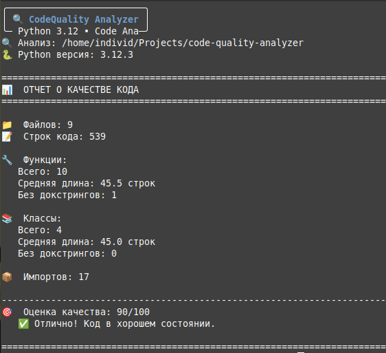
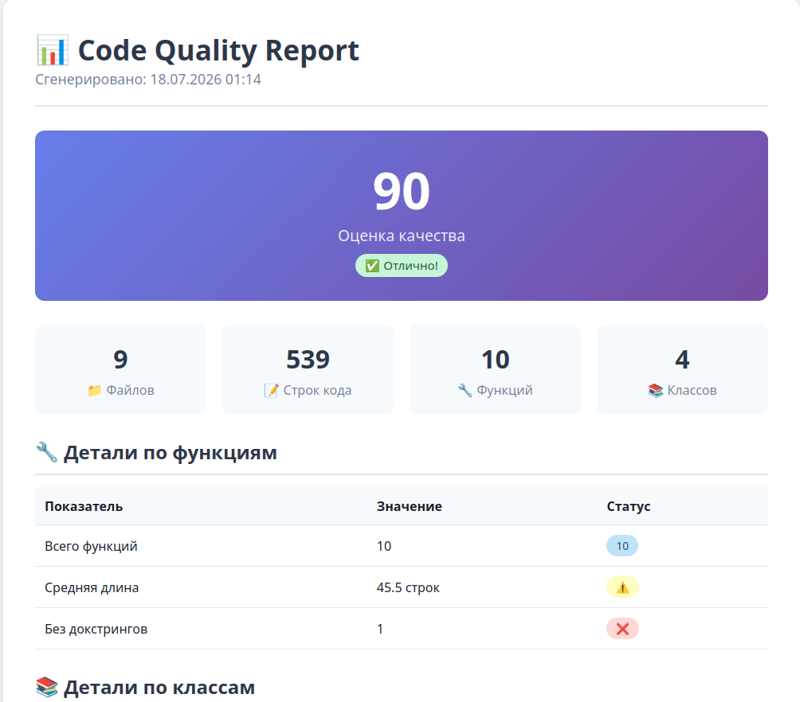

# 🔍 CodeQuality Analyzer

_Мгновенный статический анализ Python-кода для повышения его качества и читаемости._

---

CodeQuality Analyzer — это инструмент командной строки, который помогает разработчикам быстро оценить качество кода, найти слабые места и получить конкретные метрики для улучшения проекта. Просто укажите путь к папке и получите детальный отчёт.

---

## ✨ Почему CodeQuality Analyzer?

- **Мгновенная оценка:** Получите общую оценку качества вашего кода по шкале от 0 до 100 за секунды.
- **Детальные метрики:** Анализ структуры (функции, классы, импорты), подсчёт строк, проверка докстрингов.
- **Удобные форматы:** Цветной вывод в терминал, структурированный JSON или готовый HTML-отчёт для шеринга.
- **Простота использования:** Одна команда для анализа проекта — никакой сложной настройки.

---

## 📸 Скриншоты

### Основной отчёт в терминале


*Пример цветного вывода с оценкой качества и метриками.*

### HTML-отчёт в браузере


*Визуализация результатов в удобном HTML-формате для детального анализа.*

---

## 📋 Все команды

code-analyzer ./ Анализ текущей папки
code-analyzer /путь/к/проекту Анализ конкретного проекта
code-analyzer ./ --verbose Подробный вывод со списком функций
code-analyzer ./ --json Вывод результатов в формате JSON
code-analyzer ./ --html report.html Генерация HTML-отчёта
code-analyzer --help Показать справку

---

## 🗂️ Где мои данные?

Анализатор не сохраняет ваши данные на диск. Все отчёты генерируются "на лету" и выводятся в консоль или по указанному вами пути (для HTML-файла).

---

### 1. Клонируйте репозиторий
```bash
git clone https://github.com/individ1337/code-quality-analyzer.git
cd code-quality-analyzer

### 2. Создайте виртуальное окружение
```bash
python3 -m venv venv
source venv/bin/activate  # для Linux/Mac
# venv\Scripts\activate   # для Windows

### 3. Установите зависимости и проект
```bash
pip install -r requirements.txt
pip install -e .

### 4. Запустите анализ!
Теперь вы можете анализировать любой Python-проект:
```bash
code-analyzer /путь/к/вашему/проекту

---

📜 Лицензия

Этот проект распространяется под лицензией MIT. Подробности в файле LICENSE.


